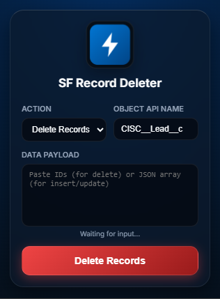
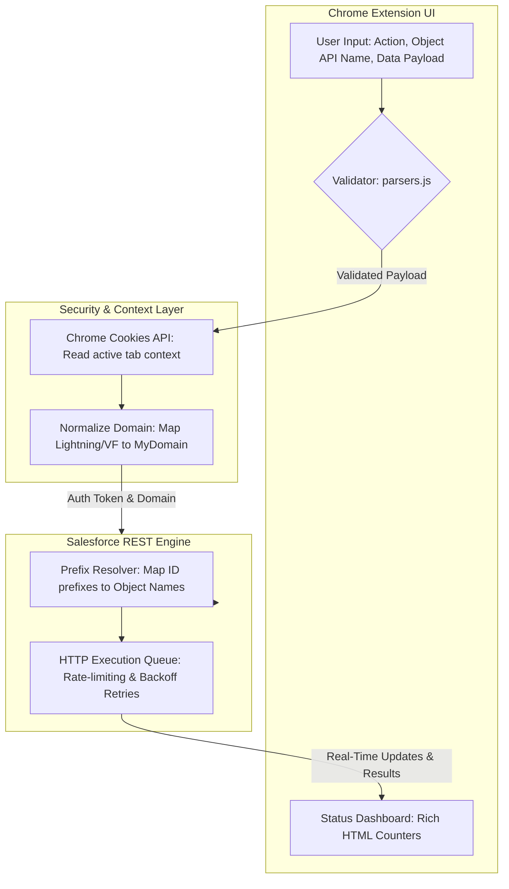

<p align="center">
  
</p>

<h1 align="center">⚡ SF Record Deleter</h1>

<p align="center">
  <a href="manifest.json"></a>
  <a href="manifest.json"></a>
  <a href="https://developer.chrome.com/docs/extensions"></a>
  <a href="LICENSE"></a>
</p>

An ultra-sleek, modular Chrome Extension designed for **Salesforce CRM** administrators and developers. It serves as a rapid record manager to perform bulk **Delete**, **Insert**, and **Update** pipelines directly from the browser popup using your active Salesforce browser session—without configuring integrations or sharing API credentials. Features an interactive dashboard, automatic Object Name prefix-resolution, cancellation control, and color-coded status tracking.

---

## 🌟 Key Features

*   ⚡ **Zero-Configuration Authentication**: Instantly securely inherits session cookies (`sid`) from active Salesforce tabs (supports standard, custom, My Domain, and Visualforce URLs).
*   🗑️ **Auto Prefix-Resolution**: Delete records by raw IDs; the extension dynamically queries Salesforce SObject metadata on the fly to match ID key-prefixes to correct Object API names automatically.
*   📤 **Bulk Insert & Update**: Input arrays of JSON records directly. Insert new entries, or patch existing ones using their `Id` fields.
*   🛑 **Abort & Control**: Cancel operations mid-stream with a single click of the pause/cancel button, allowing safe checkpoints.
*   🎨 **Interactive Color-Coded Logs**: Real-time status reporting with multi-color highlights:
    *   `Success` in **Green**
    *   `Already Deleted` in **Orange**
    *   `Failed` in **Red**
*   🚀 **Enterprise Resiliency**: Equipped with exponential backoff retry algorithms and configurable rate-limiting (100ms throttle by default).

---

<h2 align="center">🖼️ Screenshot</h2>

<p align="center">
  
</p>

---

## 🚀 How It Works



---

## 📂 Project Architecture

```
SF-Record-Deleter/
├── icon48.png               # Extension icon (48x48)
├── icon48.svg               # Vector source of extension icon
├── gemini-svg.svg           # Custom vector assets
├── popup.html               # Main popup structure, CSS styles & layout
├── popup.js                 # Main orchestrator & UI controller
├── src/                     # Modular business logic (ES Modules)
│   ├── api/
│   │   └── salesforce.js    # Cookie extractors, prefix mappings & execution flow
│   ├── config/
│   │   └── config.js        # Global configuration parameters & constants
│   └── utils/
│       └── parsers.js       # Payload parser, ID validator & logger helper
├── manifest.json            # Extension configuration manifest
└── README.md                # Documentation
```

---

## 📥 Input Formats

### 1. Delete (Comma- or Newline-separated IDs)
```text
001xx000003DGb1AAG
003xx000004TmiHAAS
```

### 2. Insert (JSON Array)
```json
[
  { "Name": "Acme Corp", "Industry": "Technology" },
  { "Name": "Cloud Solutions", "Industry": "Consulting" }
]
```

### 3. Update (JSON Array with `Id` fields)
```json
[
  { "Id": "001xx000003DGb1AAG", "Industry": "Healthcare" },
  { "Id": "001xx000003DGb2AAG", "Industry": "Finance" }
]
```

---

## 🛠️ Installation & Setup

1.  Clone this repository locally:
    ```bash
    git clone https://github.com/kaileyventures/SF-Record-Deleter.git
    ```
2.  Open **Google Chrome** and navigate to `chrome://extensions/`.
3.  Enable **Developer mode** (toggle in the top-right corner).
4.  Click on **Load unpacked** (top-left corner).
5.  Select the `SF-Record-Deleter` root folder.
6.  Open a Salesforce tab in Chrome, click the extension icon, and begin processing records!

---

## 💡 Tech Stack

*   **HTML5 / CSS3** – Glassmorphic style design with responsive layouts and customized color accents.
*   **JavaScript (ES Modules)** – Modern modular design allowing clean, componentized logic importing.
*   **Salesforce REST API** – Integration with SObjects REST endpoints (using `v58.0` metadata endpoints).
*   **Chrome Extension API (MV3)** – Manifest V3 compliant popup scripts and session permission scopes.

---

## 📄 License

Distributed under the MIT License. See `LICENSE` for more information.
